<h1 align="center">Howto: Noble su btrfs con layout snapper</h1>
<div style="page-break-after: always"></div>

<!-- TOC -->

- [HowTo: Noble su btrfs con layout snapper](#howto-noble-su-btrfs-con-layout-snapper)
- [Tabella spazio temporale](#tabella-spazio-temporale)
- [Preparazione del disco](#preparazione-del-disco)
- [Preparazione del volume btrfs](#preparazione-del-volume-btrfs)
  - [Creazione del subvolume @](#creazione-del-subvolume-)
  - [Il "first root filesystem"](#il-first-root-filesystem)
- [Installazione di Ubuntu](#installazione-di-ubuntu)
- [Attività successive l'installazione](#attività-successive-linstallazione)
  - [Montare i subvolumi](#montare-i-subvolumi)
  - [Aggiornare fstab](#aggiornare-fstab)
  - [Riavvio](#riavvio)
- [Primo avvio](#primo-avvio)
  - [Configurare snapper sul sistema appena avviato](#configurare-snapper-sul-sistema-appena-avviato)
  - [Creare la configurazione per la /home](#creare-la-configurazione-per-la-home)
  - [Installare Btrfs Assistant](#installare-btrfs-assistant)
  - [Installare grub-btrfs (opzionale)](#installare-grub-btrfs-opzionale)
- [Operazione di restore](#operazione-di-restore)
  - [Operazione di restore](#operazione-di-restore-1)
    - [Restore con snapper](#restore-con-snapper)
    - [Restore con Btrfs Assistant](#restore-con-btrfs-assistant)
    - [Restore nel caso il sistema non si avvii](#restore-nel-caso-il-sistema-non-si-avvii)

<!-- /TOC -->
<!-- /TOC -->

<div style="page-break-after: always"></div>

# HowTo: Noble su btrfs con layout snapper

In questo "HowTo", verrà descritto come installare Ubuntu 24.04 con un layout del filesystem btrfs "OpenSuse-like". Al termine della procedura il risultato sarà una installazione Ubuntu Noble su filesystem btrfs. Le funzionalità del filesystem verranno gestite con snapper + Btrfs Assistant. La procedura prevede che il device di installazione, sia preparato in anticipo rispetto l'installazione, e sarà un'attività manuale. L'obiettivo è fornire una procedura di tipo "copia e incolla" alla portata di tutti. 

# Tabella spazio temporale

L'installazione è stata divisa in diversi passaggi.  
La tabella di seguito pubblicata, inquadra i vari passaggi in relazione all'ambiente di esecuzione e allo stato dell'installazione.  

Passaggio | Ambiente | Installazione in corso
--- | --- | ---
Preparazione del disco | Live | No
Preparazione del volume btrfs | Live | No
Installazione di Ubuntu | Live | Si, in corso
Attività successive l'installazione | Live | No, terminata
Primo avvio | Ubuntu | N/A
Installazione di btrfsassistant | Ubuntu | N/A

# Preparazione del disco

L'installazione proposta prevede che il dispositivo di installazione sia già pronto, e non necessiti di formattazione.  
I requisiti minimi per l'installazione, in termini di storage sono:
- partizione EFI/ESP (almeno 100Mb, in caso di dual boot si condivide quella di windows)
- partizione btrfs (consigliati un minimo di 50Gb)

Il dispositivo di installazione si può preparare anche con gparted nella Live.
Se si sta installando in dual boot, e sia necessario ridurre una (o più) partizione(i) in uso,
si consiglia di utilizzare gli strumenti di windows.


caso di esempio | esempio con gparted
---|---
dual boot | 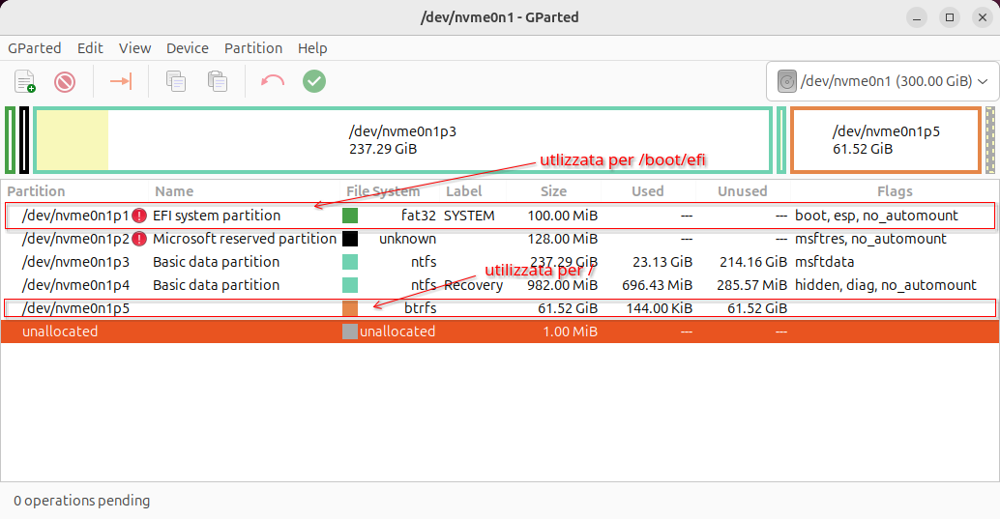
single boot | 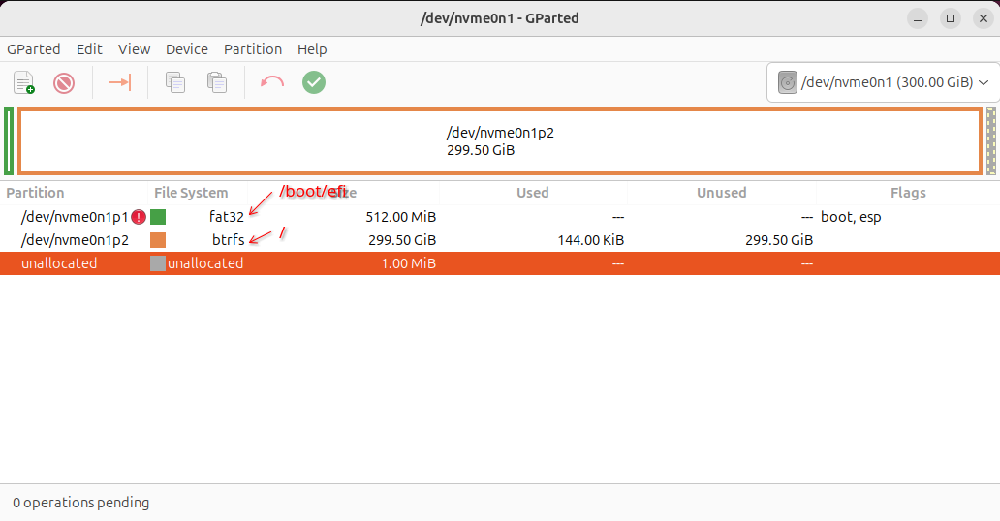

Nota: questa guida è pensata per essere eseguita in modalità copia e incolla.
Prima di effettuare il copia e incolla verificare che la variabile `BTRFSDEV` della guida, risolve correttamente il device da utilizzare.  
(in alternativa, modificare il device `$BTRFSDEV`, con il proprio device btrfs)

```bash
BTRFSDEV=$(sudo blkid | grep btrfs | cut -d ":" -f1)
echo $BTRFSDEV
```

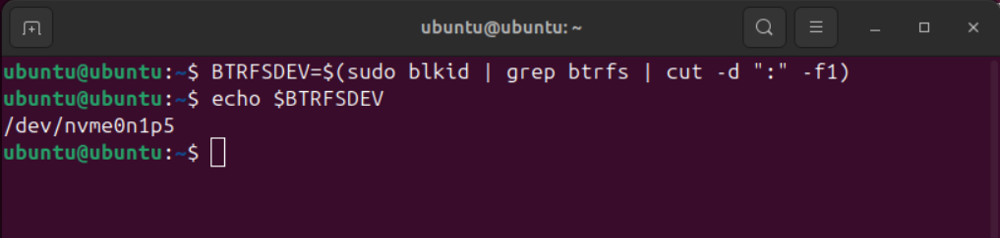


# Preparazione del volume btrfs

Prima di avviare l'installazione, sarà necessario preparare il volume btrfs.  
E' possibile utilizzare un terminale dalla Live.  

## Creazione del subvolume @

Si monta il filesystem btrfs creato nel precedente step, e si crea il subvolume @ (ID=256) (il secondo subvolume del volume. Il primo è subvolid=5).  

```bash
BTRFSDEV=$(sudo blkid | grep btrfs | cut -d ":" -f1)
sudo mount $BTRFSDEV /mnt  
sudo btrfs subvolume create /mnt/@
```

## Il "first root filesystem"

Si crea la directory:

```bash
sudo mkdir /mnt/@/etc/snapper/configs -p
```

Si modifica il default subvolume, e si rimonta il volume:

```bash
BTRFSDEV=$(sudo blkid | grep btrfs | cut -d ":" -f1)
sudo btrfs subvolume set-default /mnt/@
sudo umount /mnt && sudo mount $BTRFSDEV /mnt
```

Si installa, configura e utilizza snapper per creare il "first root filesystem" (sulla Live)  

```bash
sudo apt install snapper -y
systemctl stop snapper-timeline.timer  # prima dell'installazione non vogliamo le snapshot di tipo timeline
sudo snapper create-config /mnt
sudo cp /etc/snapper/configs/root  /mnt/etc/snapper/configs/
sudo sed -i s@\"/mnt\"@\"/\"@ /mnt/etc/snapper/configs/root
sudo snapper create -t single -d "first root filesystem" --read-write --from 0
```

Ci creano i subvolumi di interesse, infine si modifica il default subvolume con il "first root filesystem".

```bash
sudo btrfs subvolume create /mnt/home
sudo mkdir /mnt/var/lib -p
sudo btrfs subvolume create /mnt/var/cache
sudo btrfs subvolume create /mnt/var/log
sudo btrfs subvolume create /mnt/var/tmp
sudo chmod 1777 /mnt/var/tmp
sudo btrfs subvolume create /mnt/var/lib/flatpack
sudo btrfs subvolume set-default /mnt/.snapshots/1/snapshot
sudo umount /mnt
```

Inizia l'installazione.  

# Installazione di Ubuntu

Eseguire l'installazione seguendo le istruzioni a video.  
Personalizzare il setup del device di installazione: 

Schermata di installazione | Operazione da effettuare
---|---
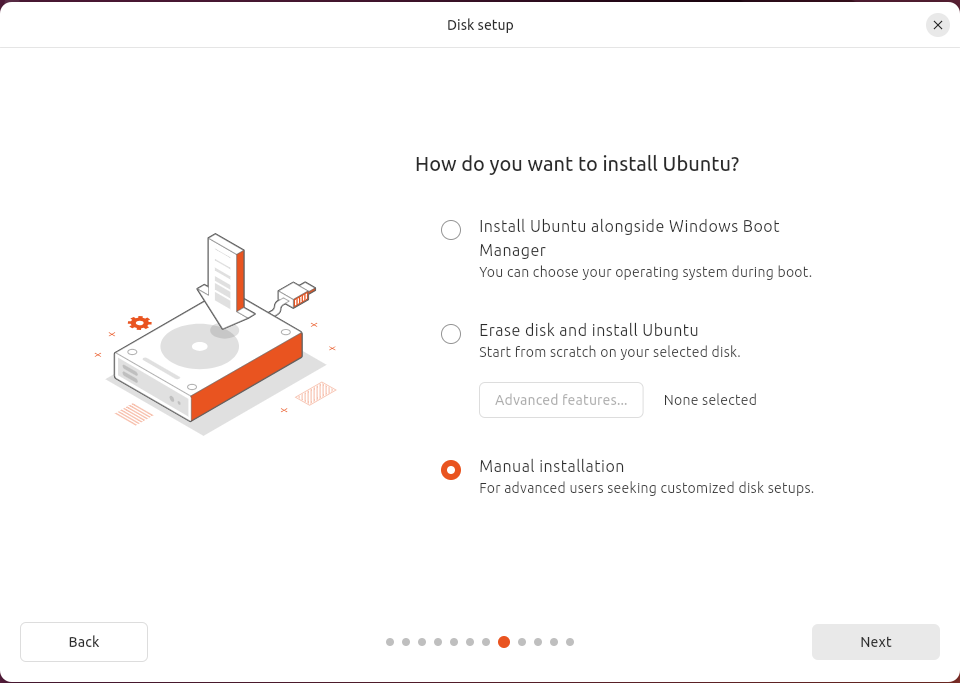| Selezionare "Installazione manuale"
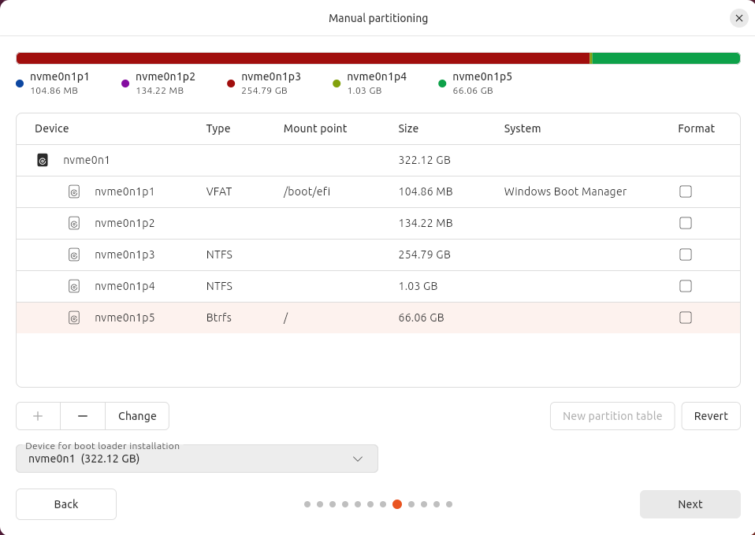| Configurare le partizioni:<br>1. ESP/EFI da utilizzare in /boot/efi<br>2. btrfs da utilizzare in /<br>Attenzione, le partizioni non vanno formattate  


Attenzione, le partizioni non vanno formattate, il dispositivo è stato configurato per l'installazione, durante i passaggi Preparazione del disco, e Preparazione del volume btrfs.  
Non riavviare dopo l'installazione. Si renderà necessario effettuare delle attività, successive l'installazione e precedenti il primo avvio.  

# Attività successive l'installazione

## Montare i subvolumi

Si verifica che tutti subvolumi si montino correttamente dove atteso e come atteso

```bash
BTRFSDEV=$(sudo blkid | grep btrfs | cut -d ":" -f1)
sudo mount $BTRFSDEV /mnt
sudo mount -o subvol=@/home $BTRFSDEV /mnt/home
sudo mount -o subvol=@/var/cache $BTRFSDEV /mnt/var/cache
sudo mkdir /mnt/var/lib/flatpack -p
sudo mount -o subvol=@/var/log $BTRFSDEV /mnt/var/log
sudo mount -o subvol=@/var/tmp $BTRFSDEV /mnt/var/tmp
sudo mount -o subvol=@/var/lib/flatpack $BTRFSDEV /mnt/var/lib/flatpack
sudo mount -o subvol=@/.snapshots $BTRFSDEV /mnt/.snapshots
```

## Aggiornare fstab

Si aggiorna il file `/mnt/etc/fstab` perchè monti i subvolumi attesi dove atteso.  

```bash
BTRFSDEV=$(sudo blkid | grep btrfs | cut -d ":" -f1)
line=$(grep -n btrfs /mnt/etc/fstab | cut -d":" -f1)
echo "sudo sed -i '"$line"s/.$/0/' /mnt/etc/fstab" | sh # vedi Nota
DISP=$(grep btrfs /mnt/etc/fstab | awk '{print $1}')
echo -n -e "\n# btrfs\n" | sudo tee -a /mnt/etc/fstab
grep btrfs /etc/mtab \
| grep -v "1/snapshot" \
| sed s@rw.*,subvolid=.*,@defaults,@ \ 
| sed s@/mnt@@ \
| sed s@$BTRFSDEV@$DISP@ \
| sudo tee -a /mnt/etc/fstab
```

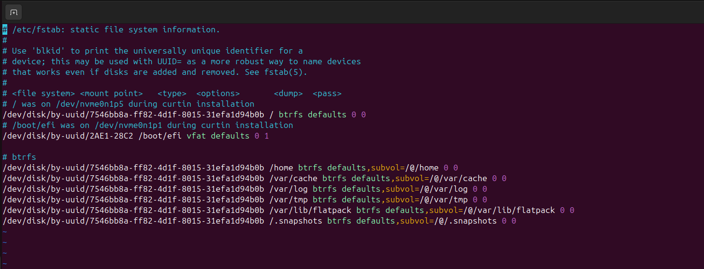

Nota: Qualora si volessero personalizzare le opzioni di mount, l'operazione è possibile in questo contesto. Eseguire i comandi modificati con le opzioni, al posto del valore "defaults". Maggiori dettagli riguardo le opezioni di mount: Opzioni di mount.  

```bash
BTRFSDEV=$(sudo blkid | grep btrfs | cut -d ":" -f1)
line=$(grep -n btrfs /mnt/etc/fstab | cut -d":" -f1)
echo "sudo sed -i '"$line"s/.$/0/' /mnt/etc/fstab" | sh
echo "sudo sed -i '"$line"s/defaults/<opzione 1>,<opzione 2>/' /mnt/etc/fstab" | sh 
DISP=$(grep btrfs /mnt/etc/fstab | awk '{print $1}')
echo -n -e "\n# btrfs\n" | sudo tee -a /mnt/etc/fstab
| grep btrfs /etc/mtab \
| grep -v "1/snapshot" \
| sed s@rw.*,subvolid=.*,@<opzione 1>,<opzione 2>,@ \  
| sed s@/mnt@@ \
| sed s@$BTRFSDEV@$DISP@ \
| sudo tee -a /mnt/etc/fstab
```

## Riavvio

Si smontano tutti i subvolumi montati in /mnt, e si riavvia.  

```bash
sudo umount /mnt/.snapshots 
sudo umount /mnt/var/tmp 
sudo umount /mnt/var/cache
sudo umount /mnt/var/log
sudo umount /mnt/var/lib/flatpack
sudo umount /mnt/home 
sudo umount /mnt
sudo shutdown -r now
```


# Primo avvio

## Configurare snapper sul sistema appena avviato

Si installa e configura snapper.  

```bash
sudo apt install snapper -y
```  
Il file di configurazione `/etc/snapper/configs/root`, è stato ereditato dal subvolume @.  
Abilitiamo la configurazione nel file `/etc/default/snapper`.. 

```bash
sudo sed -i s/SNAPPER_CONFIGS=\"\"/SNAPPER_CONFIGS=\"root\"/g /etc/default/snapper
```  

Si riavvia snapper per attivare la configurazione.  

```bash
sudo systemctl restart snapperd
```

Si abilita la quota, in questo modo l'algoritmo di pulizia e raccolta delle snapshots, potrà onorare le direttive `SPACE_LIMIT` e `FREE_LIMIT`.  
Inoltre, l'output del comando `snapper list` fornirà informazioni riguardo lo spazio utilizzato.    

```bash
sudo btrfs quota enable /
sudo snapper setup-quota
sudo snapper list
```

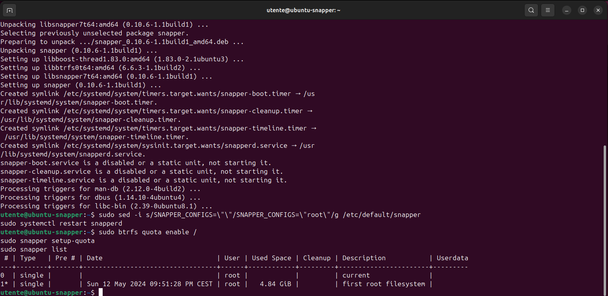

## Creare la configurazione per la /home

Si crea la configurazione `home`, in modo da usufruire delle snapshots anche per il subvolume /home.  

```bash
sudo snapper -c home create-config /home
```

## Installare Btrfs Assistant

Un tool grafico, potente e intuitivo, che si può utilizzare per gestire `snapper`, è certamente `Btrfs Assistant`.  

Sfortunatamente, questo software, non è disponibile nei repository ufficiali.  
Non esiste neanche un repository PPA.  

Attualmente, l'unico riferimento ad un pacchetto Ubuntu è: https://launchpad.net/ubuntu/+source/btrfs-assistant  (la versione 1.8, è vecchia di un anno. La versione corrente è 2.1)

Le istruzioni per l'installazione sono disponibili nella documentazione ufficiale.  

https://gitlab.com/btrfs-assistant/btrfs-assistant  


1. Prerequisiti per l'installazione

```bash
sudo apt install git cmake fonts-noto qt6-base-dev qt6-base-dev-tools \
g++ libbtrfs-dev libbtrfsutil-dev pkexec qt6-svg-dev qt6-tools-dev
```

2. Scaricare i sorgenti 
Per questo punto, si hanno a disposizione due opzioni:  
la versione main, o ultima versione.
Se si vuole installare la versione main:

```bash
git clone https://gitlab.com/btrfs-assistant/btrfs-assistant.git
cd btrfs-assistant
```

Per l'ultima versione:

```bash
wget https://gitlab.com/btrfs-assistant/btrfs-assistant/-/archive/2.1/btrfs-assistant-2.1.tar.gz
tar xvf btrfs-assistant-2.1.tar.gz
cd btrfs-assistant-2.1
```

1. Costruire il software

```bash
cmake -B build -S . -DCMAKE_INSTALL_PREFIX=/usr -DCMAKE_BUILD_TYPE='Release'
make -C build
```

4. Installare il software

```bash
sudo make -C build install
```
 
5. Disinstallazione (eventuale)

Perchè il software possa essere disinstallato, è necessario conservare la directory in cui è stato costruito.  
La lista dei files installati, è presente nella sottodirectory `build`.  
Il comando di disinstallazione è:  

```bash
cd build
sudo xargs rm < install_manifest.txt
```


Contenuto del file `install_manifest.txt` dopo l'installazione:

```ascii
/etc/btrfs-assistant.conf
/usr/share/applications/btrfs-assistant.desktop
/usr/share/metainfo/btrfs-assistant.metainfo.xml
/usr/share/polkit-1/actions/org.btrfs-assistant.pkexec.policy
/usr/bin/btrfs-assistant
/usr/bin/btrfs-assistant-launcher
/usr/bin/btrfs-assistant-bin
```

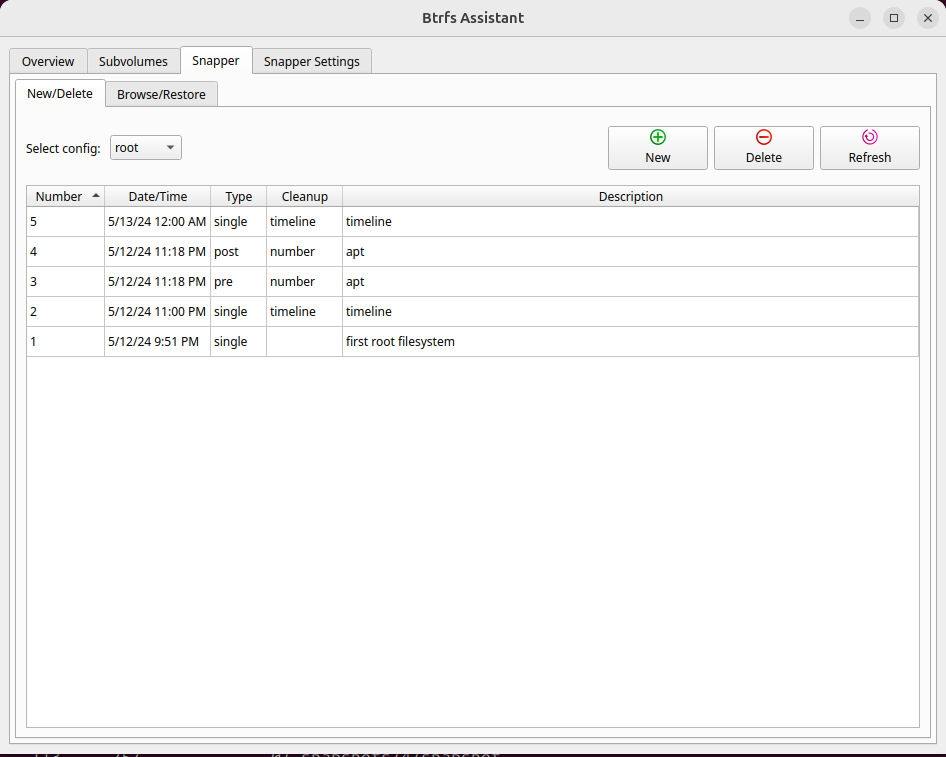

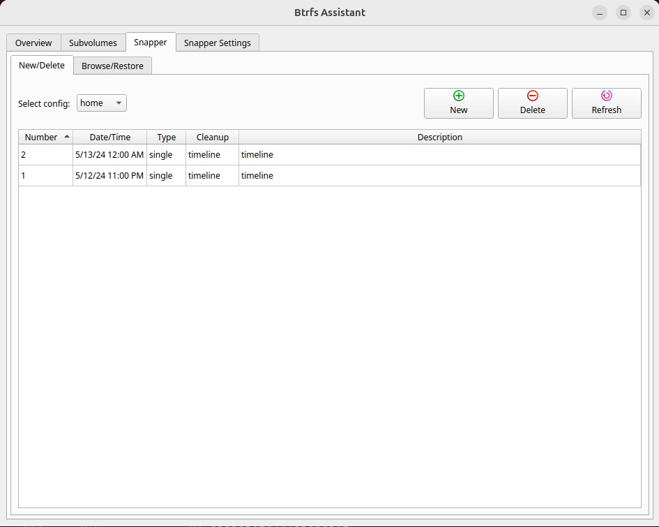

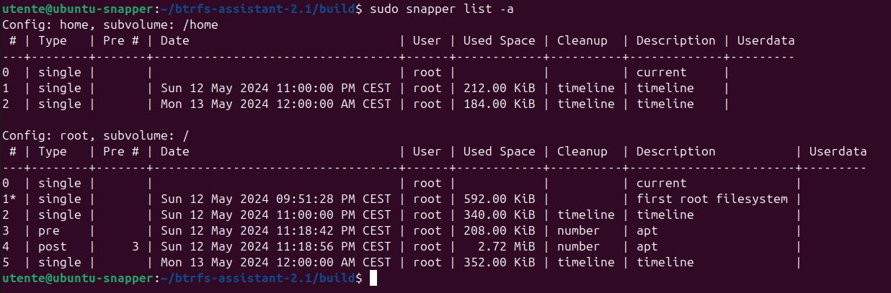

Nel caso si installasse il pacchetto `btrfsmaintenance`, il software `Btrfs Assistant`, potrà essere utilizzato anche per gestire le operazioni di manutenzione del filesystem.  

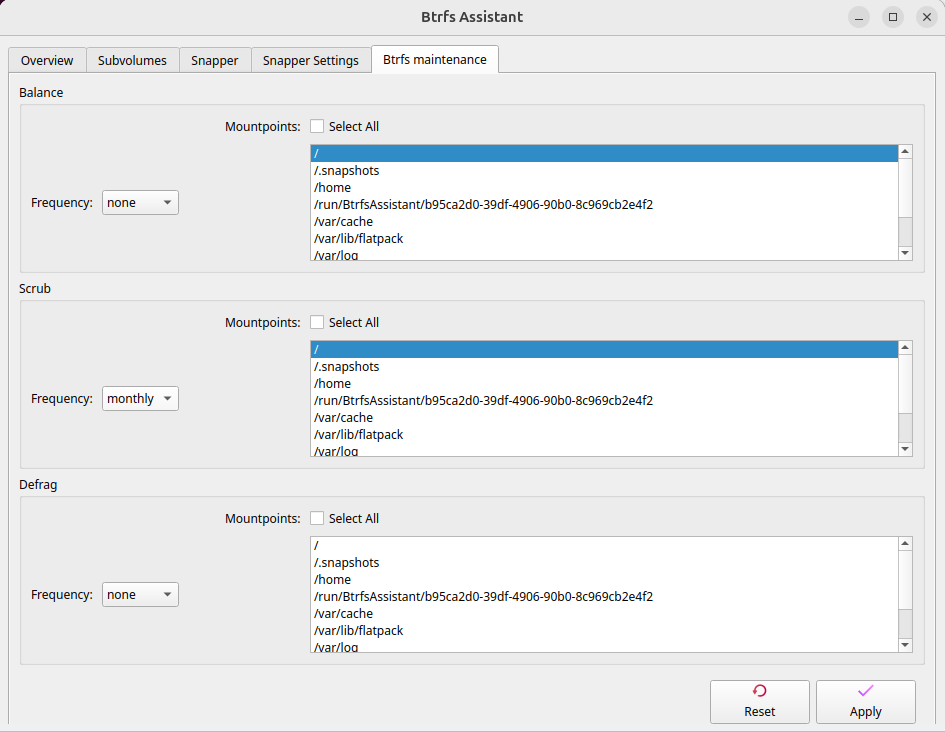

## Installare grub-btrfs (opzionale)

'grub-btrfs' è una collezione di scripts che permette di eseguire il boot da una snapshot.  
La collezione di script è ben testata su distribuzioni come Arch e OpenSuse, per cui su Ubuntu, potrebbero esserci errori e/o limitazioni.  
L'avvio del sistema, utilizzando una snapshot read-only come filesystem radice, potrebbe non terminare con successo.
Esistono diverse strategie per avviare una snapshot read-only con successo, la migliore è avviare con il supporto a overlayfs. 
Questa feature è documentata per Arch e per le distruzioni che utilizzano '''dracut''':  
https://github.com/Antynea/grub-btrfs/blob/master/initramfs/readme.md  

Per le istruzioni di installazione e per la verifica dei prerequisiti si può consultare:  
https://github.com/Antynea/grub-btrfs/tree/master?tab=readme-ov-file#manual-installation  

In breve:

```bash
git clone https://github.com/Antynea/grub-btrfs.git
cd grub-btrfs
sudo make install
```

Al termine dell'installazione, se venisse riportato il warning:
```txt
WARNING: 'grub-mkconfig' needs to run at least once to generate the snapshots (sub)menu entry in grub the main menu. After that this script can run alone to generate the snapshot entries.
```

sarà necessario eseguire un l'aggiornamento del file grub.cfg.  
```bash
sudo update-grub
```

Per automatizzare la rigenerazione del menù di '''grug''' è necessario abilitare il servizio grub-btrfsd.  

```bash
sudo apt install inotify-tools
sudo systemctl start grub-btrfsd
sudo systemctl enable grub-btrfsd
```

Nota: si vuole utilizzare '''snapper''' per la restore, grub-btrfs è mandatorio.
Se si vuole utilizzare '''Btrfs Assistant''', grub-btrfs è opzionale.  


# Operazione di restore

Aggiungere Nota: riguardo il significato di "restore" su btrfs

## Operazione di restore

Si immagini di corrompere un sistema durante un upgrade.  
Il primo passaggio da eseguire è identificare l'`<ID>` della snapshot che si vuole utilizzare come "root" filesystem.  
Si seleziona la snapshot 25;  
si riporta il sistema all'avvio precedente l'upgrade.  

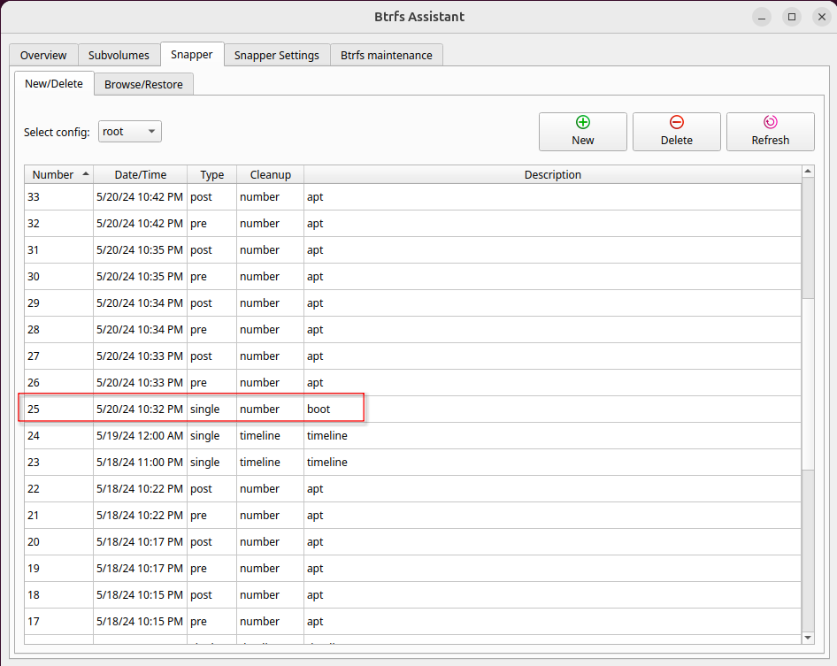

### Restore con snapper
La restore con '''snapper''', riassunta per punti, prevede:
- `snapper rollback <ID>` --> Questo comando modifica il default subvolume dal corrente a una copia r/w di `<ID>`. 
- riavvio nella snapshot "copia r/w di `<ID>`"
- rigenerazione dei file di configurazione di grub (`update-grub` su Ubuntu)
- riavvio 

1. Eseguire il `roolback`

```bash
sudo snapper rollback 25
```

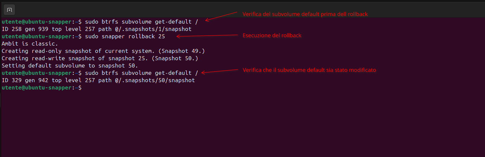

2. Riavviare

Nel menù di grub, selezionare "Ubuntu snapshots".  

Nel sottomenù selezionare la voce "copia r/w di `<ID>`"

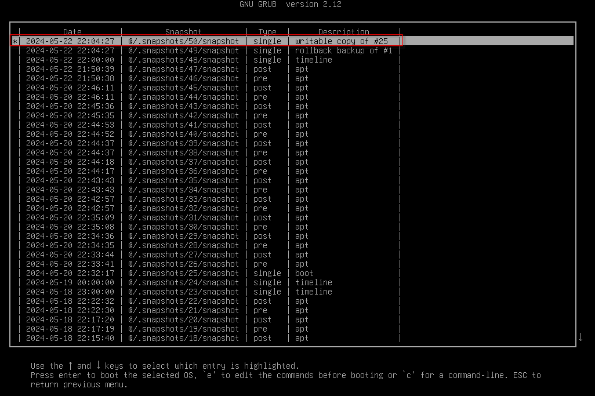

Una volta terminato il reboot si verifica che il filesystem radice sia quello atteso.  

```bash
findmnt /
```

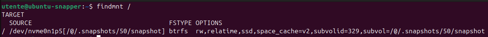

3. Rigenerare i files di configurazione di grub

```bash
sudo update-grub
sudo grub-install
```

Per le verifiche del caso:

```bash
sudo grep "/@/" /boot/efi/EFI/ubuntu/grub.cfg
sudo grep "/@/" /boot/grub/grub.cfg
```
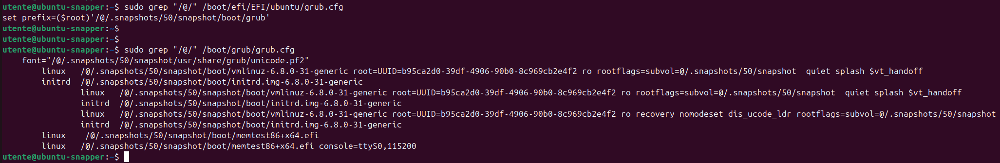

4. Riavviare

Selezionare la sessione di "Ubuntu" nel menù di grub.  
AL termine del riavvio verificare che il filesystem radice, sia quello atteso.  

```bash
findmnt /
```  

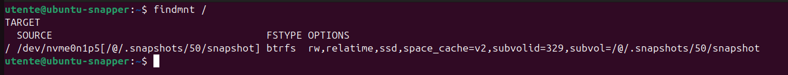

### Restore con Btrfs Assistant

L'intera procedura, si gestisce con l'interfaccia grafica.  

1. Aprire Btrfs Assistant.  
2. Selezionare il tab "Snapper".  
3. Selezionare il tab "Browse / Restore".  
4. Selezionare la snapshot che si vuole restorare dalla lista.  
5. Premere il push button "Restore".  
6. Confermare la scelta.  
7. Riavviare.  

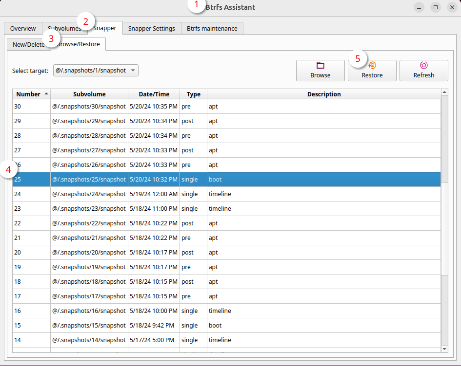

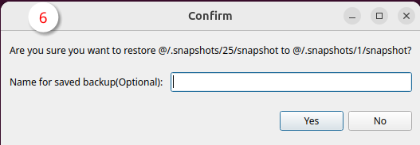
  
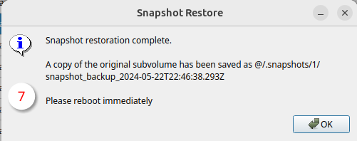

Il subvolume che è stato sostituito, non è più gestito da snapper.  
Il subvolume si dovrà cancellare manualmente.  

1. Identificare il subvolume  
```bash
BACKUP=$(sudo btrfs subvolume list / | grep backup | cut -d "@" -f 2)
echo $BACKUP
```
2. Verificare che il subolume non sia il default  
```bash
sudo btrfs subvolume get-default /
```  
2. Nel caso il check 2. sia positivo  
```bash
sudo btrfs subvolume set-default 5 /
```

3. Cancellare il subvolume
```bash
echo "sudo btrfs subvolume delete $BACKUP" | sh
```

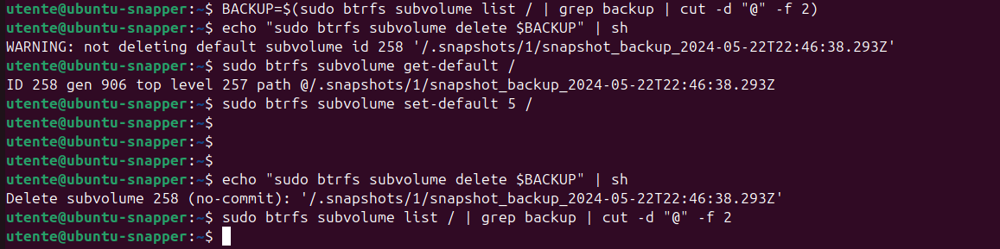

### Restore nel caso il sistema non si avvii

Uno dei modi più semplici per ripristinare una snapshot su un sistema che non si avvia, è utilizzando la Live(Installazione/CreazioneLiveUsb/CreatoreDischiDiAvvio) da un supporto usb(Installazione/AvvioSupportoDiInstallazione).  

1. Aprire una shell e montare il filesystem.  
Montare il subvolume `ID 5 (FS_TREE)` e il subvolume `/@/.snapshots`.  

```bash
BTRFSDEV=$(sudo blkid | grep btrfs | cut -d ":" -f1)
sudo mount -o subvolid=5,subvol=/ $BTRFSDEV /mnt
sudo mount -o subvol=/@/.snapshots $BTRFSDEV /mnt/@/.snapshots
```

2. "Restore"  
Rinominare il subvolume da sostituire.    

```bash
sudo mv /mnt/@/.snapshots/1/snapshot /mnt/@/.snapshots/1/snapshot_backup
```
"Restore" del subvolume selezionato

```bash
sudo btrfs subvolume snapshot /mnt/@/.snapshots/25/snapshot /mnt/@/.snapshots/1/snapshot
```

E' possibile modificare la descrizione "first root filesystem".  
Editor di testo con privilegi amministrativi.  
Modificare il campo `<description>` nel file "/mnt/@/.snapshots/1/info.xml". 

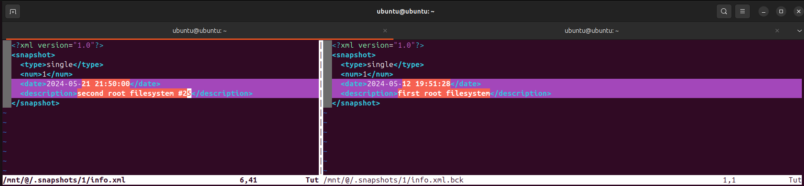

3. Riavviare

```bash
sudo umount /mnt/@/.snapshots
sudo umount /mnt
sudo shutdown -r now
```

```bash
for sub in $(sudo btrfs subvolume list /mnt | cut -d "@" -f2); \
do RO=$(sudo btrfs property get /mnt/@$sub ro| cut -d "=" -f2); \
if [ "$RO" = "false" ]; \
then sudo test -f /mnt/@$sub/boot/grub/grub.cfg && echo "/mnt/@$sub candidato per la sostituzione" || continue; \
fi; \
done
```


