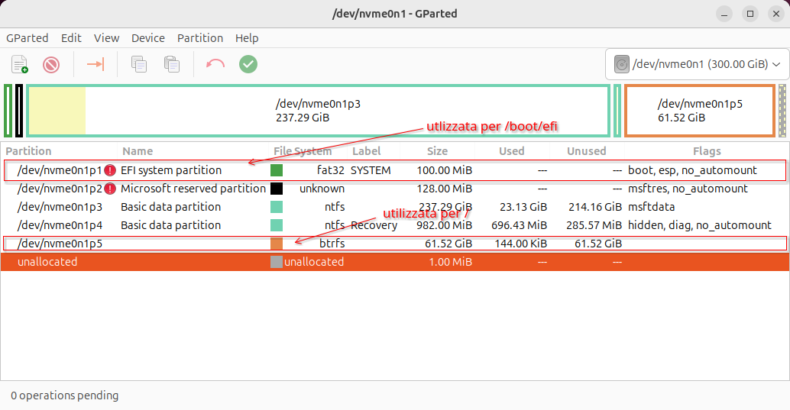
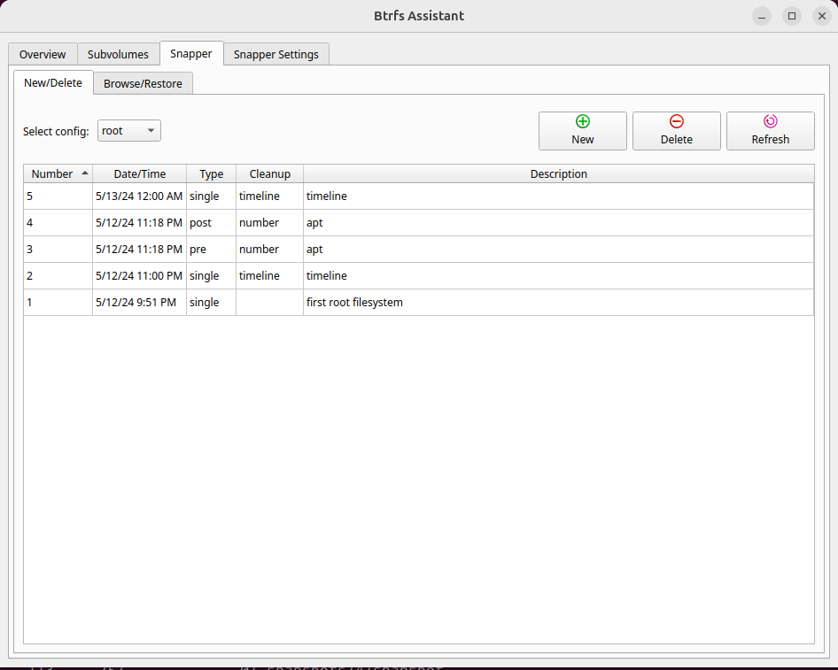
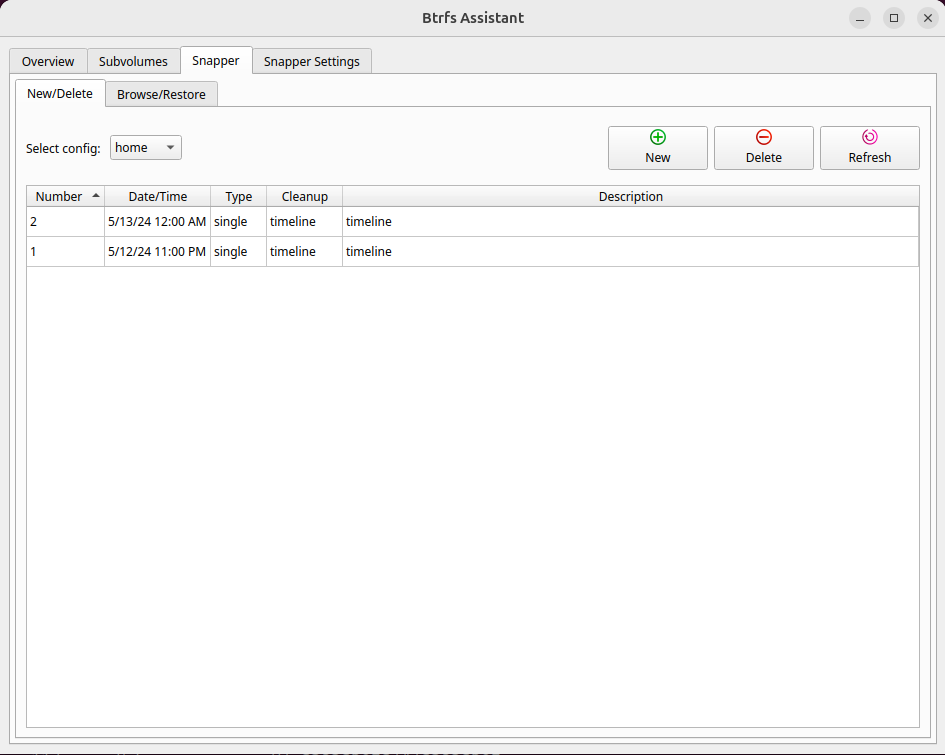
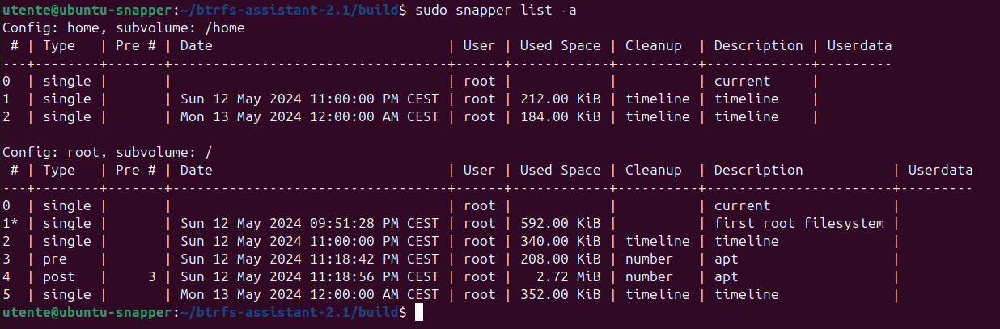
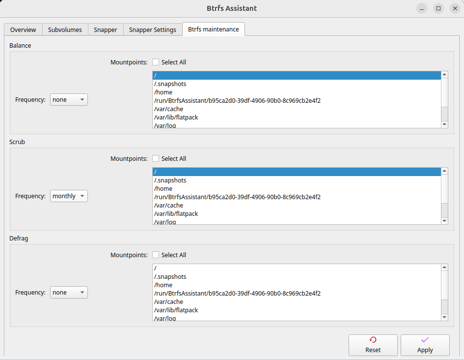

<h1 align="center">Howto: Installare Noble su filesystem btrfs gestito da timeshift</h1>
<div style="page-break-after: always"></div>

<!-- TOC -->

- [Tabella spazio temporale](#tabella-spazio-temporale)
- [Preparazione del disco](#preparazione-del-disco)
- [Preparazione del volume btrfs](#preparazione-del-volume-btrfs)
  - [Creazione dei subvolumi](#creazione-dei-subvolumi)
  - [Definizione del subvolume di installazione](#definizione-del-subvolume-di-installazione)
- [Installazione di Ubuntu](#installazione-di-ubuntu)
- [Attività successive l'installazione](#attività-successive-linstallazione)
  - [Montare i subvolumi](#montare-i-subvolumi)
  - [Aggiornare fstab](#aggiornare-fstab)
  - [Riavvio](#riavvio)
- [Primo avvio](#primo-avvio)
  - [Installazione di Timeshift](#installazione-di-timeshift)
  - [Creare la configurazione per la /home](#creare-la-configurazione-per-la-home)
  - [Installare Btrfs Assistant](#installare-btrfs-assistant)

<!-- /TOC -->

<!-- /TOC -->
# Tabella spazio temporale

L'installazione è stata divisa in diversi passaggi.  
La tabella di seguito pubblicata, inquadra i vari passaggi in relazione all'ambiente di esecuzione e allo stato dell'installazione.  

Passaggio | Ambiente | Installazione in corso
--- | --- | ---
Preparazione del disco | Live | No
Preparazione del volume btrfs | Live | No
Installazione di Ubuntu | Live | Si, in corso
Attività successive l'installazione | Live | No, terminata
Primo avvio | Ubuntu | N/A
Installazione di timeshift | Ubuntu | N/A

# Preparazione del disco

L'installazione proposta prevede che il dispositivo di installazione sia già pronto, e non necessiti di formattazione.  
I requisiti minimi per l'installazione, in termini di storage sono:
- partizione EFI/ESP (almeno 100Mb, in caso di dual boot si condivide quella di windows)
- partizione btrfs (consigliati un minimo di 50Gb)

Il dispositivo di installazione si può preparare anche con gparted nella Live.
Se si sta installando in dual boot, e sia necessario ridurre una (o più) partizione(i) in uso,
si consiglia di utilizzare gli strumenti di windows.


caso di esempio | esempio con gparted
---|---
dual boot | 
single boot | 

Nota: questa guida è pensata per essere eseguita in modalità copia e incolla.
Prima di effettuare il copia e incolla verificare che la variabile `BTRFSDEV` della guida, risolve correttamente il device da utilizzare.  
(in alternativa, modificare il device `$BTRFSDEV`, con il proprio device btrfs)

```bash
BTRFSDEV=$(sudo blkid | grep btrfs | cut -d ":" -f1)
echo $BTRFSDEV
```


# Preparazione del volume btrfs

Prima di avviare l'installazione, sarà necessario preparare il volume btrfs.  
E' possibile utilizzare un terminale dalla Live.  

## Creazione dei subvolumi

Si monta il filesystem btrfs creato nel precedente step, e si creano i subvolumi che verranno utilizzato dopo l'installazione.  

```bash
BTRFSDEV=$(sudo blkid | grep btrfs | cut -d ":" -f1)
sudo mount $BTRFSDEV /mnt  
sudo btrfs subvolume create /mnt/@
sudo btrfs subvolume create /mnt/@home
sudo btrfs subvolume create /mnt/@var/cache -p
sudo btrfs subvolume create /mnt/@var/log -p
sudo btrfs subvolume create /mnt/@var/tmp -p
sudo btrfs subvolume create /mnt/@var/lib/flatpack -p
```


## Definizione del subvolume di installazione

```bash
sudo btrfs subvolume set-default /mnt/@
sudo umount /mnt
```

Inizia l'installazione.  

# Installazione di Ubuntu

Eseguire l'installazione seguendo le istruzioni a video.  
Personalizzare il setup del device di installazione: 

Schermata di installazione | Operazione da effettuare
---|---
| Selezionare "Installazione manuale"
| Configurare le partizioni:<br>1. ESP/EFI da utilizzare in /boot/efi<br>2. btrfs da utilizzare in /<br>Attenzione, le partizioni non vanno formattate  


Attenzione, le partizioni non vanno formattate, il dispositivo è stato configurato per l'installazione, durante i passaggi Preparazione del disco, e Preparazione del volume btrfs.


# Attività successive l'installazione

## Montare i subvolumi

Si verifica che tutti subvolumi si montino correttamente dove atteso e come atteso

```bash
BTRFSDEV=$(sudo blkid | grep btrfs | cut -d ":" -f1)
sudo mount $BTRFSDEV /mnt
sudo mount -o subvol=@home $BTRFSDEV /mnt/home
sudo mount -o subvol=@var/cache $BTRFSDEV /mnt/var/cache
sudo mount -o subvol=@var/log $BTRFSDEV /mnt/var/log
sudo mount -o subvol=@var/tmp $BTRFSDEV /mnt/var/tmp
sudo mkdir /mnt/var/lib/flatpack -p 
sudo mount -o subvol=@var/lib/flatpack $BTRFSDEV /mnt/var/lib/flatpack
```

## Aggiornare fstab

Si aggiorna il file `/mnt/etc/fstab` perchè monti i subvolumi attesi dove atteso.  

```bash
BTRFSDEV=$(sudo blkid | grep btrfs | cut -d ":" -f1)
line=$(grep -n btrfs /mnt/etc/fstab | cut -d":" -f1)
DISP=$(grep btrfs /mnt/etc/fstab | awk '{print $1}')
echo "sudo sed -i '"$line"s/^/#/' /mnt/etc/fstab" | sh 
sudo cp -p /mnt/etc/fstab /mnt/etc/fstab.bak
echo -n -e "\n# btrfs\n" | sudo tee -a /mnt/etc/fstab    # vedi Nota
grep btrfs /etc/mtab | \
grep -v target | \
sed s@rw.*,subvolid=.*,@defaults,@  | \
sed s@/mnt@/@ | \
sed s@//@/@ | \
sed s@$BTRFSDEV@$DISP@ | \
sudo tee -a /mnt/etc/fstab 
```


Nota: se si volessero personalizzare le opzioni di mount, l'operazione è possibile in questo contesto.  
Eseguire i comandi modificati con le opzioni, al posto del valore "defaults".  

```bash
BTRFSDEV=$(sudo blkid | grep btrfs | cut -d ":" -f1)
DISP=$(grep btrfs /mnt/etc/fstab | awk '{print $1}')
line=$(grep -n btrfs /mnt/etc/fstab | cut -d":" -f1)
echo "sudo sed -i '"$line"s/^/#/' /mnt/etc/fstab" | sh 
sudo cp -p /mnt/etc/fstab /mnt/etc/fstab.bak
echo -n -e "\n# btrfs\n" | sudo tee -a /mnt/etc/fstab
grep btrfs /etc/mtab | \
grep -v target | \
sed s@rw.*,subvolid=.*,@<opzione 1>,<opzione 2>,@  | \
sed s@/mnt@/@ | \
sed s@//@/@ | \
sed s@$BTRFSDEV@$DISP@ | \
sudo tee -a /mnt/etc/fstab
```

## Riavvio

Si smontano tutti i subvolumi montati in /mnt, e si riavvia.  

```bash

sudo umount /mnt/var/tmp 
sudo umount /mnt/var/cache
sudo umount /mnt/var/log
sudo umount /mnt/var/lib/flatpack
sudo umount /mnt/home
sudo btrfs subvolume set-default 5 /mnt
sudo umount /mnt
sudo shutdown -r now
```


# Primo avvio

## Installazione di Timeshift

Link alla pagina Timeshift

## Creare la configurazione per la /home

Si crea la configurazione `home`, in modo da usufruire delle snapshots anche per il subvolume /home.  

```bash
sudo snapper -c home create-config /home
```

## Installare Btrfs Assistant

Un tool grafico, potente e intuitivo, che si può utilizzare per gestire `snapper`, è certamente `Btrfs Assistant`.  

Sfortunatamente, questo software, non è disponibile nei repository ufficiali.  
Non esiste neanche un repository PPA.  

Attualmente, l'unico riferimento ufficiale(?) ad un pacchetto Ubuntu è: https://launchpad.net/ubuntu/+source/btrfs-assistant  (la versione 1.8, è vecchia di un anno. La versione corrente è 2.1)

Le istruzioni per l'installazione sono disponibili nella documentazione ufficiale.  

https://gitlab.com/btrfs-assistant/btrfs-assistant  


1. Prerequisiti per l'installazione

```bash
sudo apt install git cmake fonts-noto qt6-base-dev qt6-base-dev-tools \
g++ libbtrfs-dev libbtrfsutil-dev pkexec qt6-svg-dev qt6-tools-dev
```

2. Scaricare i sorgenti 
Per questo punto, si hanno a disposizione due opzioni:  
la versione main, o ultima versione.
Se si vuole installare la versione main:

```bash
git clone https://gitlab.com/btrfs-assistant/btrfs-assistant.git
cd btrfs-assistant
```

Per l'ultima versione:

```bash
wget https://gitlab.com/btrfs-assistant/btrfs-assistant/-/archive/2.1/btrfs-assistant-2.1.tar.gz
tar xvf btrfs-assistant-2.1.tar.gz
cd btrfs-assistant-2.1
```

1. Costruire il software

```bash
cmake -B build -S . -DCMAKE_INSTALL_PREFIX=/usr -DCMAKE_BUILD_TYPE='Release'
make -C build
```

4. Installare il software

```bash
sudo make -C build install
```
 
5. Disinstallazione (eventuale)

Perchè il software possa essere disinstallato, è necessario conservare la directory in cui è stato costruito.  
La lista dei files installati, è presente nella sottodirectory `build`.  
Il comando di disinstallazione è:  

```bash
cd build
sudo xargs rm < install_manifest.txt
```


Contenuto del file `install_manifest` dopo l'installazione:

```ascii
/etc/btrfs-assistant.conf
/usr/share/applications/btrfs-assistant.desktop
/usr/share/metainfo/btrfs-assistant.metainfo.xml
/usr/share/polkit-1/actions/org.btrfs-assistant.pkexec.policy
/usr/bin/btrfs-assistant
/usr/bin/btrfs-assistant-launcher
/usr/bin/btrfs-assistant-bin
```







Nel caso si installasse il pacchetto `btrfsmaintenance`, il software `Btrfs Assistant`, potrà essere utilizzato anche per gestire le operazioni di manutenzione del filesystem.  




